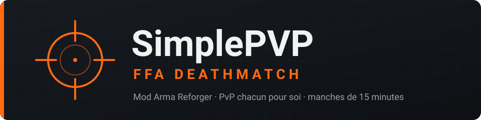
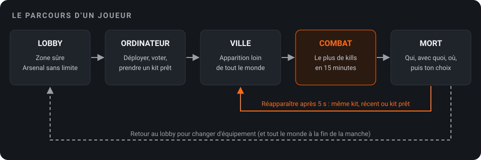
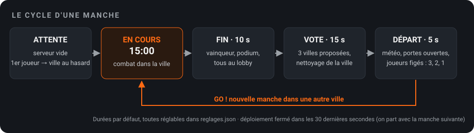
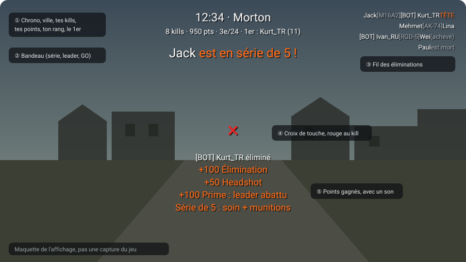
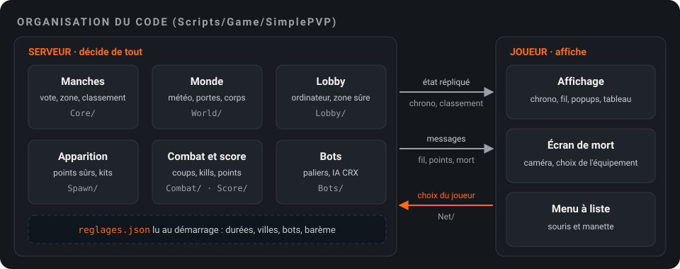

<p align="center"></p>

# SimplePVP | FFA Deathmatch

Mod **Arma Reforger** de PvP pur, en **chacun pour soi**, façon Call of Duty.

> **EN** — A pure free-for-all deathmatch mod for Arma Reforger. You gear up in a safe lobby with an unrestricted
> arsenal, deploy into a city, and try to get the most kills in 15 minutes. AI bots fill in when few players are
> online. When the round ends, everyone votes for the next city and it starts again.

---

## L'idée

1. **Le lobby** : une zone sûre où personne ne peut se blesser. On y trouve un **arsenal sans aucune restriction**
   (arme, tenue, sac, accessoires) et un **ordinateur de déploiement**.
2. **Le déploiement** : on apparaît dans une **ville d'Everon**, loin des autres combattants.
3. **Le but** : faire **le plus de kills possible**. Tout le monde est ennemi de tout le monde.
4. **La manche** dure **15 minutes**. À la fin : résultats (vainqueur, podium, médailles), tout le monde revient au
   lobby, on **vote pour la ville suivante** parmi 3, puis départ groupé avec « 3, 2, 1, GO ».
5. **Des bots** (IA) complètent la partie quand il y a peu de joueurs, et s'effacent quand le serveur se remplit.

<p align="center"></p>

Le nom a été choisi pour être compris d'un Français, d'un Anglais, d'un Turc et d'un Chinois : *FFA* parle aux
joueurs de CS, *Deathmatch* se traduit directement (死亡竞赛).

---

## Comment ça fonctionne

### Une manche

<p align="center"></p>

- La **première manche** part dès qu'un joueur est là, dans une ville tirée au sort.
- On peut **se déployer à tout moment** depuis le lobby, sauf dans les 30 dernières secondes : on part alors avec la
  manche suivante (file d'attente).
- **Hors de la zone** de jeu (un cercle autour de la ville), on a 10 s pour revenir, sinon on meurt.
- La **zone** est petite ou grande selon le nombre de joueurs. La **météo** et **l'heure** changent à chaque manche
  (environ une manche sur 6 de nuit, jamais deux de suite). Les **portes** de la ville sont ouvertes.
- Les corps, objets et mines sont nettoyés entre deux manches.

### Apparition et mort

- Le point d'apparition est choisi **loin de tout le monde**, en évitant les endroits où l'on vient de tirer ou de
  mourir. On peut ajouter à la main des points aux étages et sur les toits (entité `SPVP_SpawnPoint`).
- **Protection d'apparition** : 5 s à 10 % des dégâts, coupée dès qu'on tire ou qu'on vise.
- **Écran de mort** : qui t'a tué, avec quelle arme, à quelle distance, la vie qui lui reste. La caméra monte
  au-dessus du corps et regarde d'où venait le tir (sans jamais montrer le tueur).
- On choisit alors : **même équipement**, un des **3 derniers**, un **kit prêt**, ou **retour au lobby**.
  Réapparition 5 s après la mort au plus tôt.
- Les **kits prêts** (Assaut, Mitrailleur, Tireur d'élite, Antichar, Grenadier, Éclaireur) viennent des soldats du
  jeu de base.

### Score

| Action | Points |
|---|---|
| Kill (joueur ou bot) | 100 |
| Headshot | +50 |
| Kill à plus de 150 m | +50 |
| Assistance (touché dans les 10 s avant sa mort) | +50 |
| Tuer le 1er du classement (prime) | +100 |

- **Classement** : le plus de kills, puis le moins de morts, puis le premier arrivé à ce total.
- **Mort « bête »** (chute, sa propre grenade, hors zone) : le kill va au dernier qui t'a touché dans les 30 s.
- **Quitter en pleine blessure** compte comme une mort ; le kill va au dernier tireur.
- **Séries** : à 3, 5 et 10 kills sans mourir, soin complet et chargeurs pleins.
- Seul un **vrai joueur** peut gagner la manche ; les bots sont classés avec l'étiquette `[BOT]`.
- Un joueur qui revient dans les 5 minutes retrouve son score de la manche.

### À l'écran (façon CoD)

<p align="center"></p>
<p align="center"><sub>Maquette de l'affichage prévu (le mod n'a pas encore tourné en jeu : pas de vraie capture pour l'instant).</sub></p>

- En haut : chrono, ville, tes kills, tes points, ton rang et le 1er.
- Fil des éliminations (tueur, arme, victime, TÊTE), popups « +100 Élimination », croix de touche (rouge au kill).
- Bandeaux : série, nouveau leader, 1 minute restante, 3-2-1-GO.
- **Tableau des scores** sur la touche du tableau du jeu (P maintenu, View + Menu à la manette).
- Fin de manche : vainqueur, podium et 4 médailles (plus long tir, plus de headshots, plus longue série, plus de
  morts).

### Bots

- Nombre par paliers selon les vrais joueurs (1-3 joueurs : 10 bots, 4-7 : 6, 8-11 : 3, au-delà : aucun).
- Ils attendent qu'un vrai joueur soit déployé, se battent en chacun pour soi, fouillent les bâtiments, reçoivent
  de temps en temps un « secteur » vague où chercher, et reviennent vers le centre s'ils s'éloignent.
- IA réglée avec **CRX Enfusion A.I.** (agressive, visée réglable, portée de tir 300 m).

---

## Organisation du dépôt

<p align="center"></p>

```
mod/                      Le projet Workbench (addon « SimplePVP FFA Deathmatch »)
  addon.gproj             Projet et dépendances
  Worlds/                 Sous-scène d'Everon : calques Systèmes et Lobby
  Missions/               En-tête du scénario (32 joueurs)
  Prefabs/                Mode de jeu, factions, personnage, ordinateur du lobby
  UI/layouts/SimplePVP/   HUD, menu à liste (écran de mort)
  Configs/System/         Déclaration du menu
  Scripts/Game/SimplePVP/
    Core/                 Réglages, manches et vote, joueurs, villes
    World/                Météo, portes, nettoyage, verrou du serveur
    Lobby/                Zone sûre, actions de l'ordinateur (déployer, voter, kits)
    Spawn/                Apparition, choix du point, kits prêts
    Combat/               Protection d'apparition, règles de dégâts, points d'apparition
    Score/                Suivi des coups, calcul des kills et des points
    Bots/                 Gestion et comportement des bots
    UI/                   HUD, écran de mort, menu à liste
    Net/                  Messages serveur ↔ joueur
plan/                     Conception : 199 questions et réponses, décisions, plan des modules
docs/images/              Illustrations du README
```

Tous les scripts sont préfixés `SPVP_`.

---

## Installer et essayer

1. Copier le dossier `mod/` dans `Documents/My Games/ArmaReforgerWorkbench/addons/` (sous le nom
   `SimplePVP FFA Deathmatch`).
2. Dépendances (Workshop) : le jeu de base, **Bacon Loadout Editor** et **CRX Enfusion A.I.**
3. Ouvrir le projet dans Arma Reforger Tools (Workbench), compiler les scripts, puis lancer le monde
   `Worlds/SimplePVP_Everon/SimplePVP_Everon.ent`.
4. Au premier lancement, le serveur crée `$profile:SimplePVP/reglages.json` avec toutes les valeurs par défaut.

### Réglages du serveur (`reglages.json`)

Tout se règle sans republier le mod : durées de manche, taille des zones, délai de réapparition, météo, nombre de
bots, barème des points… Les **villes de la rotation** y sont aussi (nom, position, rayons, nombre de joueurs,
groupe, active ou non) : on peut en ajouter une sans toucher au mod.

Un fichier existant n'est jamais réécrit : pour voir apparaître de nouveaux réglages, supprimer le fichier une fois.

Sur serveur dédié, les manches ne démarrent que si `cle_serveur` contient la clé du serveur officiel (la clé n'est
pas dans ce dépôt). Aucun contrôle dans le Workbench.

---

## État du projet

Le projet a été conçu à partir d'un questionnaire de 199 questions (dossier `plan/`), puis développé en 6 livraisons.

| Livraison | Contenu | État |
|---|---|---|
| 1 | Fondations : mode de jeu, lobby, arsenal, déploiement | Codée |
| Bots | Bots par paliers, comportement CRX | Codée |
| 2 | Boucle des manches, vote, météo, portes, nettoyage | Codée |
| 3 | Apparition, écran de mort, protection, kits prêts | Codée |
| 4 | Score, HUD façon CoD, tableau, résultats | Codée |
| 5 | Règles de combat, fin de l'IA | À faire |
| 6 | Serveur public : menu staff, langues (FR, EN, TR, CN), consoles | À faire |
| Phase 2 | Statistiques, XP, top 10, Discord | Plus tard |

⚠️ **Le code n'a pas encore été compilé.** Chaque livraison a été relue, mais les premiers essais dans le Workbench
restent à faire. Les textes sont en français pour l'instant.

**Pas encore faits** : panneau de déploiement plein écran avec la carte, fondu au noir à l'apparition, lecture des
kits sauvegardés dans Bacon.

---

Projet de **Jack**.
